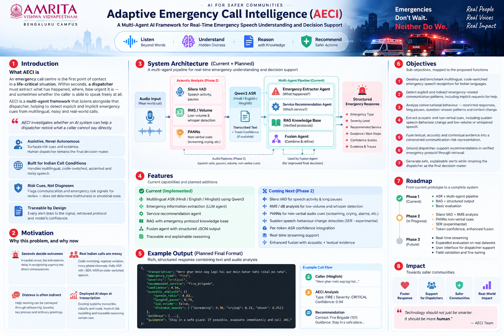

# 🚨 AECS — AI Emergency Communication System

<div align="center">

### **Voice to Action. Faster. Smarter. Safer.**

**Multilingual emergency voice processing using ASR + LLM agents + RAG + fusion**

</div>

<p align="center">
  
</p>

<p align="center">

[](https://www.python.org/)
[](https://pytorch.org/)
[](https://huggingface.co/Qwen)
[](https://huggingface.co/moorlee/qwen3-asr-0.6b-hinglish)

</p>

---

## 🧭 Overview

**AECS (AI Emergency Communication System)** is a voice-based emergency processing system designed for **Hindi, English and Hinglish** emergency conversations.

Rather than asking one model to perform every task, AECS separates the workflow into specialized components:

```text
🎙️ Voice Input
      ↓
🗣️ Qwen3 ASR
      ↓
🧠 Emergency Extractor
      ↓
🚑 Service Recommendation Agent
      ↓
📚 RAG Knowledge Base
      ↓
🔀 Fusion Agent
      ↓
📋 Structured Emergency Response

## ✨ Features

| Feature | Description |
|---|---|
| 🎙️ Voice First | Records emergency speech from the microphone |
| 🌐 Multilingual | Hindi, English and Hinglish |
| 🧠 Multi-Agent AI | Separate extraction, service and fusion components |
| 📚 RAG | Retrieves emergency-specific knowledge |
| 🚑 Service Recommendation | Recommends ambulance, police, fire brigade, rescue or unknown |
| 📋 Structured Output | Produces JSON emergency information |
| ⚡ Local Inference | Designed for local CUDA-enabled inference |

---

## 🏗️ Architecture

```text
                    🎙️ USER
                       │
                       ▼
               ┌──────────────┐
               │   Qwen3 ASR  │
               │ Speech→Text  │
               └──────┬───────┘
                      │
                      ▼
             ┌──────────────────┐
             │ Emergency        │
             │ Extractor Agent  │
             │                  │
             │ Type             │
             │ Severity         │
             │ Location         │
             │ Injuries         │
             │ People involved  │
             └────────┬─────────┘
                      │
             ┌────────┴────────┐
             ▼                 ▼
      ┌──────────────┐   ┌──────────────┐
      │ Service Agent│   │ RAG Retriever│
      │              │   │              │
      │ Police       │   │ Emergency KB│
      │ Ambulance    │   │ Fire         │
      │ Fire Brigade │   │ Medical      │
      │ Rescue       │   │ Safety       │
      └──────┬───────┘   └──────┬───────┘
             └─────────┬────────┘
                       ▼
                ┌─────────────┐
                │ Fusion Agent│
                └──────┬──────┘
                       ▼
                🚨 FINAL RESULT
```

---

## 🚨 Emergency Categories

The knowledge base covers:

- 🏥 Medical emergency
- 🔥 Fire
- 🚗 Accident
- 👮 Police / security
- 🌊 Natural disaster
- 🏠 Domestic emergency
- 🔎 Missing person
- 🆘 Personal safety
- 🛗 Trapped person
- ❓ Unknown / other

The service recommendation can use the **meaning of the complete transcript**, rather than requiring the caller to explicitly mention a service.

---

## 🎬 Live Example

### Input

> **"मेरे घर में आग लगी है और मेरा दरवाज़ा खुल नहीं रहा, पूरी तरफ आग है और मैं बाहर नहीं निकल पा रहा हूँ, मुझे हेल्प चाहिए."**

### Extracted information

```json
{
  "emergency_type": "fire",
  "severity": "critical",
  "location": null,
  "people_involved": null,
  "injuries": null,
  "additional_information": "mere darwaza khul nahi raha, mere ghar mein fire lag gayi hai"
}
```

### Final recommendation

```json
{
  "recommended_service": "fire_brigade",
  "confidence": 0.9
}
```

---

## 👮 Context-Based Service Recommendation

Example:

> **"मैं मेरे office के पास और मुझे कोई follow कर रहा है, मुझे help चाहिए."**

The system can infer a **police** recommendation from the context even though the caller did not explicitly say "police".

```json
{
  "emergency_type": "unknown_other",
  "severity": "unknown",
  "recommended_service": "police",
  "confidence": 0.9
}
```

---

## 🧩 Components

### 🎙️ Voice Pipeline
`voice_pipeline.py`

Connects microphone recording, ASR, emergency extraction, service reasoning, RAG and fusion.

### 🧠 Emergency Extractor
`emergency_processor.py`

Extracts:

```text
emergency_type
severity
location
people_involved
injuries
additional_information
```

### 🚑 Service Agent
`service_agent.py`

Determines the recommended emergency service from the transcript and extracted context.

### 📚 RAG Retriever
`rag_retriever.py`

Retrieves relevant information from the local emergency knowledge base.

### 🔀 Fusion Agent
`fusion_agent.py`

Combines the outputs into the final structured emergency response.

---

## 📚 Knowledge Base

```text
knowledge_base/
├── accident.txt
├── domestic_emergency.txt
├── fire.txt
├── medical_emergency.txt
├── missing_person.txt
├── natural_disaster.txt
├── personal_safety.txt
├── police_security.txt
├── trapped_person.txt
└── unknown_other.txt
```

---

## 🖥️ Quick Start

### 1. Clone

```bash
git clone https://github.com/5rikanth/AECS.git
cd AECS/claude_finetune
```

### 2. Activate environment

```bash
conda activate indicconformer
```

### 3. Install dependencies

```bash
pip install -r requirements.txt
```

### 4. Run

```bash
python voice_pipeline.py
```

Controls:

```text
R + ENTER → Start recording
R + ENTER → Stop recording
Q + ENTER → Quit
```

---

## 🧠 Models

| Model | Purpose |
|---|---|
| `moorlee/qwen3-asr-0.6b-hinglish` | Hindi / English / Hinglish speech recognition |
| `Qwen/Qwen2.5-1.5B-Instruct` | Emergency extraction and service reasoning |

---

## 📁 Project Structure

```text
AECS/
└── claude_finetune/
    ├── voice_pipeline.py
    ├── emergency_processor.py
    ├── service_agent.py
    ├── fusion_agent.py
    ├── rag_retriever.py
    ├── orchestrator.py
    ├── knowledge_base/
    │   ├── accident.txt
    │   ├── domestic_emergency.txt
    │   ├── fire.txt
    │   ├── medical_emergency.txt
    │   ├── missing_person.txt
    │   ├── natural_disaster.txt
    │   ├── personal_safety.txt
    │   ├── police_security.txt
    │   ├── trapped_person.txt
    │   └── unknown_other.txt
    ├── requirements.txt
    └── README.md
```

---

## 🔬 Training & Evaluation

The repository also contains development scripts for the emergency extraction and service recommendation components:

```text
create_agent_datasets.py
create_service_recommendation_data.py
prepare_extraction_data.py
train_extractor.py
train_service_recommender.py
evaluate_extractor.py
evaluate_service_recommender.py
test_finetuned_extractor.py
test_service_recommender.py
```

---

## 🛠️ Tech Stack

- 🐍 Python
- 🔥 PyTorch
- 🤗 Hugging Face
- 🗣️ Qwen3 ASR
- 🧠 Qwen2.5
- 📚 RAG
- ⚡ CUDA
- 🎙️ FFmpeg / PulseAudio

---

## 🔐 Disclaimer

AECS is an **academic/research prototype**. It is not a replacement for official emergency dispatch systems or trained emergency operators.

For an actual emergency, contact the appropriate official emergency service directly.

---

## 🗺️ Future Work

- 📱 Mobile interface
- 🌐 Web emergency dashboard
- 📍 Improved location extraction
- 🗣️ Additional Indian languages
- 📞 Emergency-service API integration
- 🔊 Voice responses
- 🧪 Larger real-world datasets
- 🔒 Privacy-preserving deployment

---

<div align="center">

### 🚨 Voice → Understand → Reason → Recommend

**Built for a safer, more responsive future.**

⭐ Star the repository if you find it useful.

</div>
